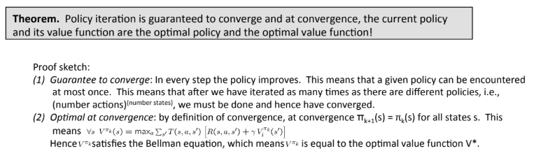
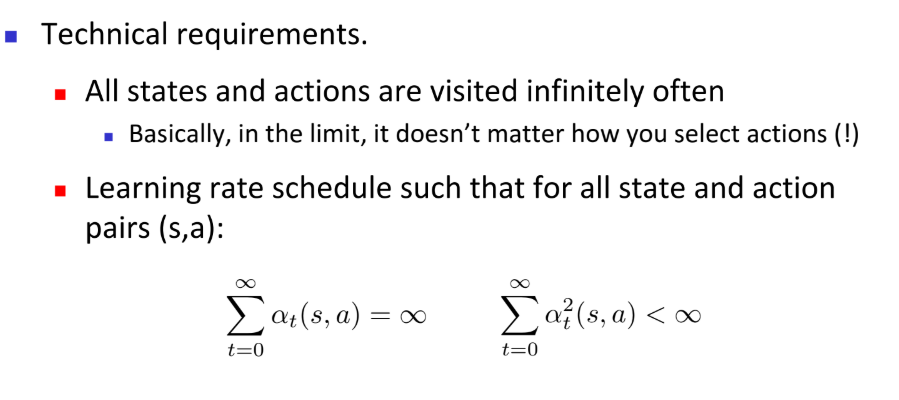

# ReinforcementLearning Qustion & Answer

集中收集了一些强化学习中的问题与回答，可能部分回答有我自己的理解错误，希望大家发现问题的话可以多提issue。

#### 1. 为什么强化学习中Q-value-iteration要把sum操作变成expectation操作？

#### 2. deterministic和stochastic的区别？

policy:

- deterministic policy is mapping from state to action.
- stochastic policy is mapping from state to `distribution over` action.

environment:

- stochastic的environment是给定s和a的情况下不一定到达确定的s'。
- deterministic的environment是给定s和a的情况下转移概率是确定的。

#### 3.为什么要有discount factor？

1) 表示对未来reward的关注程度。gamma越小，代表未来reward所占比重更小，即越不重要，更看重眼前利益。

2) 如果没有gamma，很多算法可能无法收敛，也有可能会得到$\infty$的reward(比如停留在同一个state会一直得到reward)。

3) reduce variance 减少方差。

#### 4. 如何选择discount factor?

一般根据H（整个序列长度）来决定，或者说根据具体任务决定。

#### 5. 为什么有value-function，还需要q-function？

value-function每次都需要把所有value值算一遍，而q-function不需要

#### 6. policy iteration能保证收敛吗？

可以。

#### 7. Q值更新的时候$Q_{k+1}(s,a)=(1-\alpha)Q_k(s,a)+\alpha [target]$中的$\alpha$是起到了什么作用？

假设policy是stochastic的，那么若$\alpha=1$，则Q值更新完全取决于下一次的$\pi$，这样显然是错误的。因此应该设置一个参数，保证其实未来不同情况下的平均。

#### 8. Q-learning为什么是off-policy的？

我们根据某个policy进行estimate，更新后根据新的policy进行estimate。由于我们根据不同的policy进行采样，因此实际上我们学到的是不同的policy，因此是off-policy的。

#### 9. 什么是on-policy，什么是off-policy？

#### 10. off-policy需要注意什么问题？

1) 需要多加探索，以防陷入局部最优而导致policy学的不够好。

2) 要让学习率足够小（可以逐渐降低学习率，但是不能降低太快）

#### 11. 为什么off-policy要逐渐降低学习率？

如果学习率不变切转移函数是stochastic的，Q-value可能不收敛。

#### 12. 为什么off-policy学习率不能降低太快？

#### 13. 针对off-policy学习率的问题需要什么保证？

详情见：Tommi Jaakkola, Michael I. Jordan, and Satinder P. Singh. On the convergence of stochastic iterative dynamic programming algorithms. Neural Computation, 6(6), November 1994.

#### 14. 用神经网络拟合Q值为什么会出错？（为什么用近似Q-learning而不是用tabular-Q-learning？）

1) Q值是通过神经网络计算出来的，当改变一个Q值的时候，由于神经网络的特点，其他的Q值也会随之改变，这是不稳定(unstable)的，即使在之前的迭代没有改变你的目标值，但是因为update了其他Q值，你的目标值也会改变。因此实际上target是在随时改变的，没有stable的目标值。

2) 我们online的收集经验，现在有了target和time之间的关系，而SGD需要的数据必须要是IID(独立同分布)的，然而RL的一个序列里数据并非IID。

#### 15. DQN的设计思路？

1) 使用experience replay，该方法如果用在新问题上一般设置为 a million。

2) 用minibatch的方法，从replay里面挑选，比online的方法更加steady。

3) 

## Contribution

Hongyu Zang

## Related Links

https://sites.google.com/view/deep-rl-bootcamp/lectures

